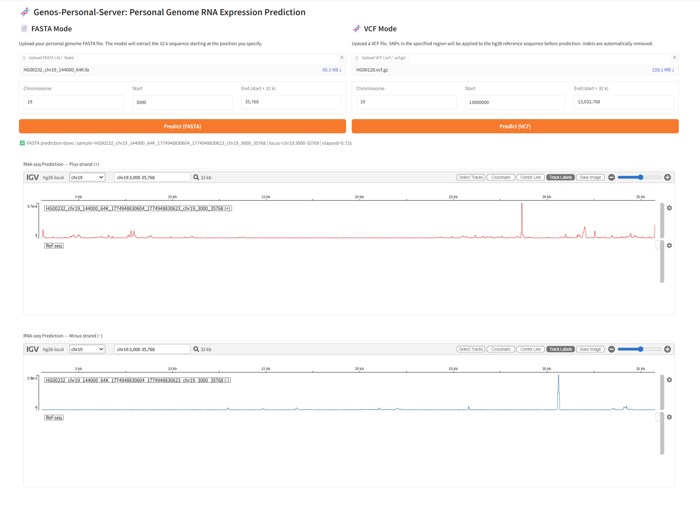
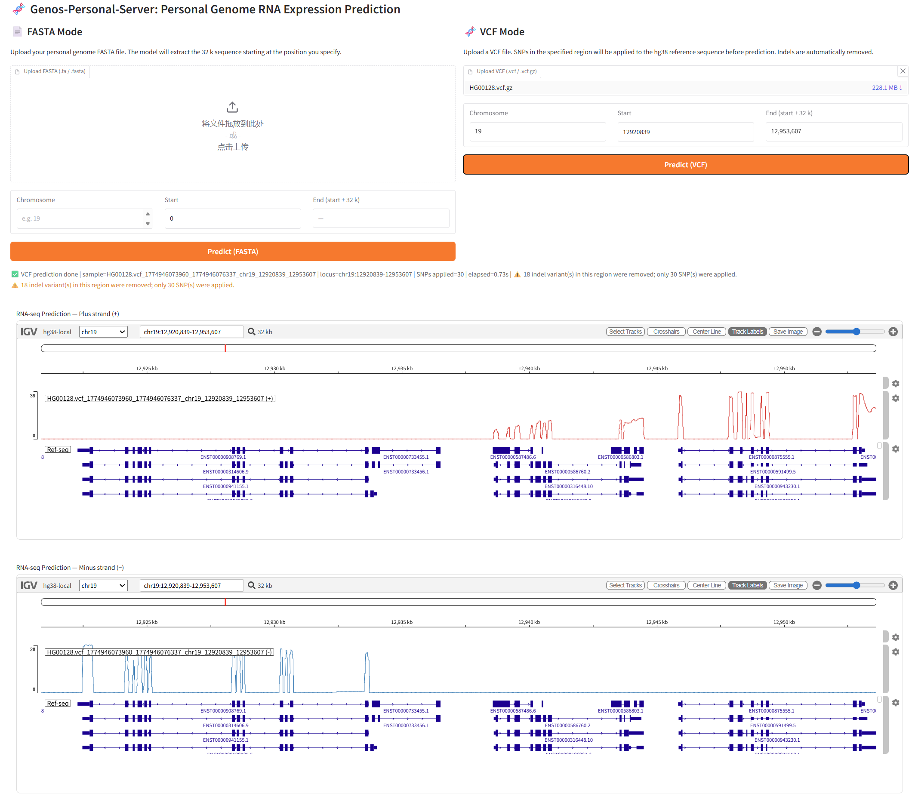

# Genos-Personal-View

## 🎯 项目介绍
Genos-Personal-View是基于 HPRC 项目提供的 100 例高质量 T2T 个人基因组 及其对应的 GM12878细胞RNA-seq 表达谱配对数据 进行训练的Genos后训练模型可视化网页，模型训练数据范围为一百人的全染色体基因组数据。Genos-Personal-View支持输入32K长度的DNA序列，输出这32K序列的RNA-seq轨迹，并在IGV插件上可视化。网页前端是Gradio和IGV.js，网页后端在FastAPI。


# 📚 快速开始

### Python 依赖

在项目根目录执行：

```bash
pip install -r backend/requirements.txt
```
说明：
- 项目包含 `torch` 与 `flash-attn` 依赖，建议使用已配置好的 CUDA 环境。
- 前后端的 python库依赖集成在backend/requirements.txt
- `api.py` 会读取 `frontend/config.py` 中的路径和参数配置，因此请同时保证根目录 `.env` 配置完整。

### 环境变量（`.env`）

env的环境变量替换成你的路径


## 🛠️ 启动项目
### 后端启动与停止
启动：
```bash
bash backend/run_backend.sh
```

停止：
```bash
bash backend/stop_backend.sh
```

### 前端启动与停止
启动：
python frontend/app.py

停止:
Ctrl + C


## 🚀 界面运行

项目支持Fasta文件和VCF两种文件模型的轨迹预测


### fasta模式预测

Predict效果页面：


### VCF模式预测

Predict效果页面：

